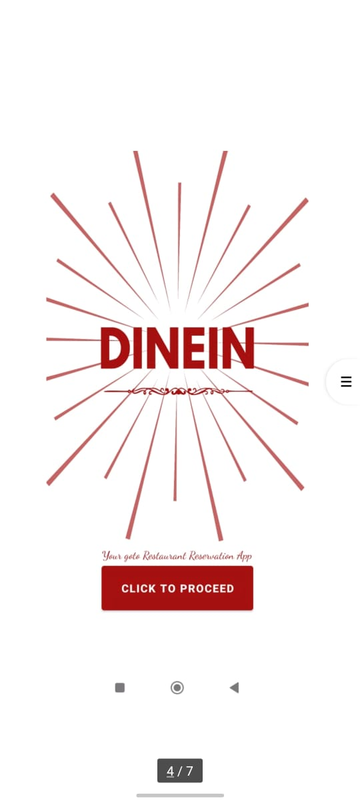
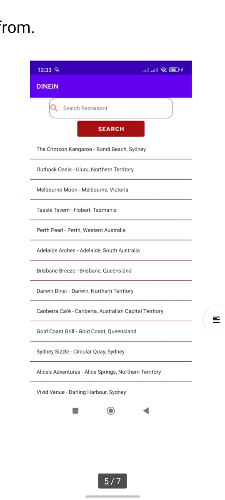
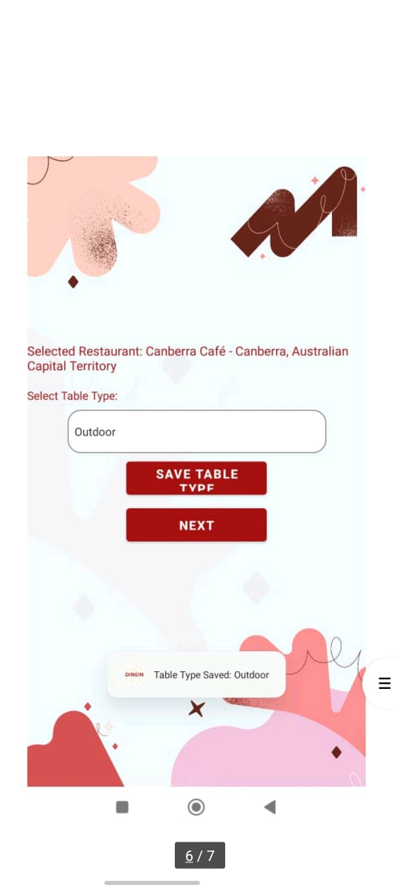
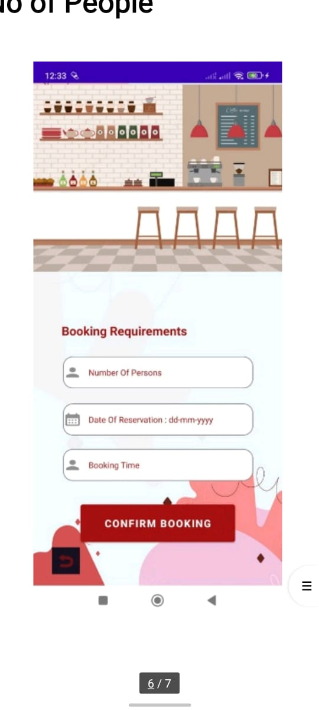
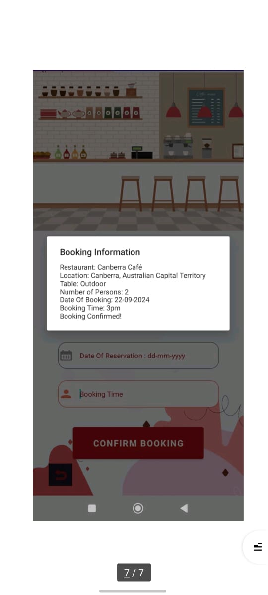

# Restaurant-Booking-Application

DineIn is a restaurant reservation application designed to assist users in booking tables at their favorite restaurants with ease. The app offers a smooth, step-by-step reservation process, allowing users to select a restaurant, choose seating preferences, and confirm booking details, all while enjoying an intuitive and interactive user interface.

## Application Flow
The application starts with a Splash Screen, followed by a Main Activity where users can begin the booking process. The booking flow includes:

### Select Restaurant: 
Users choose their preferred restaurant from a list or use a search function to locate specific options.
### Select Table Type: 
Options include Indoor, Outdoor, Window Side, Center, and Terrace.
### Enter Booking Details: 
Users specify the number of people, date, and time for their reservation.
### Booking Summary: 
A summary displays all reservation details for user confirmation.

Each step seamlessly transitions to the next, passing relevant data forward using Android intents.

#Summary 
DineIn is a comprehensive reservation application that enables users to book tables easily. Key features include:

Multi-Activity Navigation: Smooth transitions between multiple activities.
1. Data Transfer with Intents: Ensures reservation details are retained throughout the process.
2. Built-in Database: Stores booking details securely.
3. User Validation: Strict input controls ensure accurate booking data.
4. By organizing reservation data efficiently and providing a pleasant user experience, DineIn makes dining reservations straightforward and enjoyable for users.

## Project Screenshots

Here are some screenshots showcasing the application in action:

    
    
    

    
    

